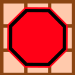
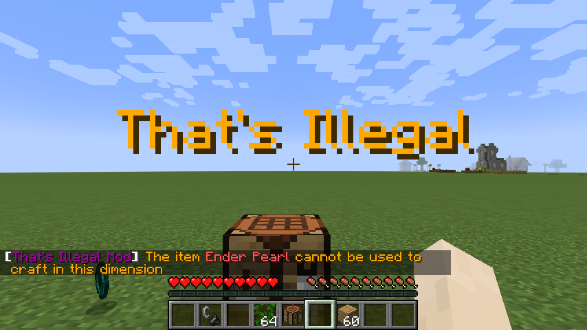
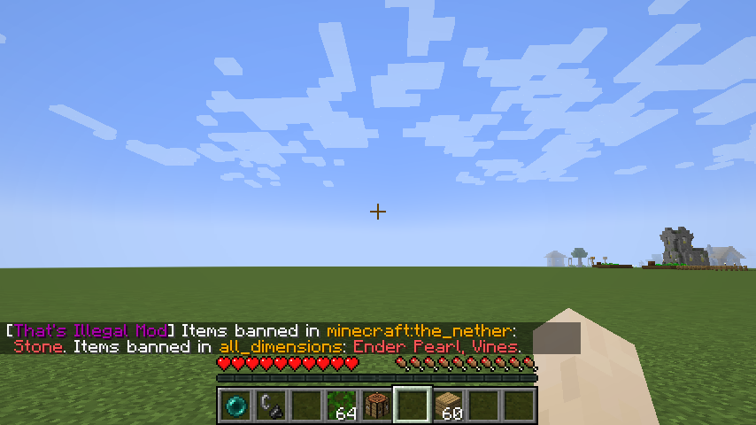
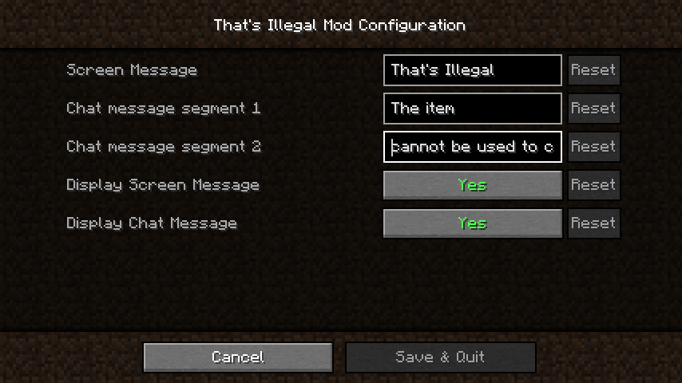

# That's Illegal Minecraft Mod



## Requires
### [Fabric API](https://www.curseforge.com/minecraft/mc-mods/fabric-api)
### [Cloth Config](https://www.curseforge.com/minecraft/mc-mods/cloth-config)

## About
That's Illegal Minecraft Mod is a **dedicated server** and **integrated server** side 
Minecraft mod that allows items to be banned from being used in a vanilla 
crafting table or in the vanilla crafting slots from a player's inventory.
The items can be banned from use in crafting on the mentioned places above 
for a specific dimension or on all dimensions. The mod also works in single 
player.

This mod can exist on a dedicated server and the connecting client does not need to
have it installed for it to work. Likewise, the mod can exist 
on a client opening their game to LAN (integrated server) 
and connecting clients do not need to have the mod on their clients 
for it to work. The client that connects to the server can 
be a vanilla client and the mod will still work if it is on the dedicated 
server side or on the integrated server side.

The options on the GUI from the configuration only work for single player games or 
for games that have been open to LAN. If the game was opened to LAN and another 
player joins the LAN game with the mod on their client, any options changed 
by the player that joined the LAN game won't have any effects. Only the 
options changed on the game of the player that opened their game to LAN 
take effect.

If a player tries to craft in a vanilla crafting table or 
in vanilla crafting slots with a banned 
item, the item will be dropped randomly on the world and if all the 
mod options to display messages are enabled, the player will receive 
a message on the screen displaying a text that is configurable on 
the server side and a message on their chat displaying a text that is also 
configurable on the server side configuration of the mod.



The command: 

### `/thatsillegal_banned_items`

can be used to get a list of 
items that are banned. An example of what is displayed 
when running this command is:



The mod [Mod Menu](https://www.curseforge.com/minecraft/mc-mods/modmenu) can 
be used to turn on and off the messages displayed and to also change 
the message that is displayed. The GUI only works for single player or 
on the side of the player that opened their game to LAN. For the server, 
the configuration must be set on the JSON configuration file.



## Configuration

Joining a world in the game initially will create a JSON configuration 
file in the **config** folder of the game profile

The default json file looks like this

**thatsillegal.json**
```json
{
  "DimensionBannedItems": {
    "CraftingBannedIngredients": {
      "minecraft:overworld": [],
      "all_dimensions": [],
      "minecraft:the_nether": [],
      "minecraft:the_end": []
    },
    "FullyBannedItems": {
      "minecraft:overworld": [],
      "all_dimensions": [],
      "minecraft:the_nether": [],
      "minecraft:the_end": []
    }
  },
  "ScreenMessage": "That\u0027s Illegal",
  "ChatMessageSegment1": "The item",
  "ChatMessageSegment2": "cannot be used to craft in this dimension",
  "ChatMessageSegment3": "cannot be used in this dimension",
  "DisplayScreenMessage": true,
  "DisplayChatMessage": true
}
```
To add items to be banned from use in crafting on a vanilla crafting table and 
a player's crafting slots, you need the item **identifier** with **namespace** 
included on the identifier. 

In the example below the item **Stone** 
is banned from use as a crafting item in **The Nether** dimension whereas the 
item **Diamond** is banned as a crafting ingredient in all dimensions.

The item **Ender Pearl** on the other hand is banned from being picked up at all by a 
player in the **Overworld** only.

```json
{
  "DimensionBannedItems": {
    "CraftingBannedIngredients": {
      "minecraft:overworld": [],
      "all_dimensions": ["minecraft:diamond"],
      "minecraft:the_nether": ["minecraft:stone"],
      "minecraft:the_end": []
    },
    "FullyBannedItems": {
      "minecraft:overworld": [
        "minecraft:ender_pearl"
      ],
      "all_dimensions": [],
      "minecraft:the_nether": [],
      "minecraft:the_end": []
    }
  },
  "ScreenMessage": "That\u0027s Illegal",
  "ChatMessageSegment1": "The item",
  "ChatMessageSegment2": "cannot be used to craft in this dimension",
  "ChatMessageSegment3": "cannot be used in this dimension",
  "DisplayScreenMessage": true,
  "DisplayChatMessage": true
}
```

**ScreenMessage** - is the message that will display on the player's screen 
when the player attempts to craft with a banned ingredient in a vanilla 
crafting table or vanilla crafting slots or attempts to pick up a banned item
from the world or a vanilla inventory like a chest

**ChatMessageSegment1** - is a segment of the message that will display 
on the player's chat
when the player attempts to craft with a banned ingredient in a vanilla
crafting table or vanilla crafting slots

**ChatMessageSegment2** - is another segment of the message that will display
on the player's chat
when the player attempts to craft with a banned ingredient in a vanilla
crafting table or vanilla crafting slots

**ChatMessageSegment3** - is another segment of the message that will display
on the player's chat
when the player attempts to pick up a banned item from the world or 
a vanilla inventory like a chest

**DisplayScreenMessage** - is an option to decide whether the server 
will send the player a message to display on their **screen** 
when the player attempts to craft with the banned item in a vanilla
crafting table or vanilla crafting slots

**DisplayChatMessage** - is an option to decide whether the server
will send the player a message to display on their **chat**
when the player attempts to craft with the banned item in a vanilla
crafting table or vanilla crafting slots

## Mod License

### [Fabric API](https://www.curseforge.com/minecraft/mc-mods/fabric-api), [Cloth Config](https://www.curseforge.com/minecraft/mc-mods/cloth-config), and [Mod Menu](https://www.curseforge.com/minecraft/mc-mods/modmenu) have each their respective licenses.

#### This mod is available under the CC0 license.


